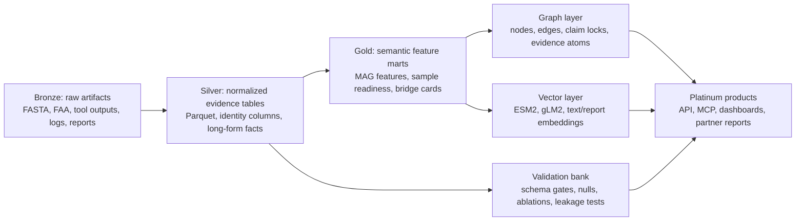

# MethaNet Queryable Molecular Attestation Data Moat

Date: 2026-06-16

Scope: implementation blueprint for turning MethaNet's current agentic workflow, ESM2 proteome embeddings, functional MAG atlas, gLM2 contextual genomics layer, metadata, and future sample/flux evidence into a queryable molecular attestation system for methane permanence-risk intelligence in blue carbon markets.

This document is a strategic architecture artifact. It does not submit jobs, mutate production outputs, or claim final MRV risk scoring.

## Executive Summary

The `methanet_agentic_workflow_moat_v3.png` infographic correctly tells the top-level story:

1. start from bridge hypotheses, MRV framing, and claim boundaries;
2. stand up reproducible HPC/cloud compute and isolated environments;
3. assemble curated reference databases;
4. produce MAG/proteome functional evidence through a gated bioinformatics workflow;
5. combine ESM2 proteome geometry, functional annotations, and gLM2 genomic context into a bridge-candidate graph;
6. publish human-readable and machine-readable artifacts;
7. eventually expose API, MCP, dashboard, partner reports, and MRV feature endpoints.

The next moat is not another report. It is a **queryable evidence substrate** that makes every MethaNet claim traceable from partner-facing intelligence back to raw files, tool versions, database releases, embeddings, feature tables, graph edges, validation gates, uncertainty, and explicit claim boundaries.

Recommended product primitive:

> MethaNet Molecular Attestation Graph, or **MMAG**: a lakehouse-backed, ontology-constrained, graph-plus-vector evidence system that answers source-aware methane-risk questions across MAGs, proteomes, genes, samples, ecosystems, annotations, embeddings, gLM2 context windows, validation gaps, and business-facing claim status.

The competitive moat is the combination of:

- **biological specialization**: methane, sulfur, substrate, redox, CAZy, MEROPS, METABOLIC, KOfam, MCycDB, SCycDB, dbCAN, QC, taxonomy;
- **representation diversity**: ESM2 proteome embeddings, gLM2 genomic context, alignment-based functional facts, sample metadata, future abundance and flux;
- **auditable provenance**: every evidence atom links to source artifact, tool run, database version, and validation gate;
- **claim-aware intelligence**: the schema stores what can be said, what is blocked, and what evidence upgrades the claim;
- **queryable product surfaces**: SQL/DuckDB, graph/Cypher, vector search, API, candidate cards, MRV feature endpoints, and partner reports all read from the same evidence substrate.

The immediate implementation should remain local-first and Parquet-first, because that matches the current MethaNet warehouse. The system should be designed so it can later move to an object-store lakehouse without changing the semantic contract.

## Local Grounding

### Source Of Truth

This architecture inherits the local MethaNet contracts:

- `proteome_id` is the canonical key for the current embedded POC and functional atlas.
- The current 662-proteome POC is a MAG/proteome-level molecular evidence layer, not a final sample/project MRV scoring layer.
- Per-MAG run folders are immutable evidence bundles.
- Cohort warehouses are derived, regenerable analytical layers.
- Functional tables must carry `cohort_run_id`, `run_id`, `proteome_id`, `mag_id`, `source_tool`, and stable table-specific keys.
- Missing pathways must be interpreted with CheckM2, GUNC, taxonomy, and annotation coverage.
- Failed, pending, partial, skipped, and missing evidence must be explicit records rather than dropped rows.
- Rumen-to-wetland transfer remains source-confounded until source-balanced validation exists.

Primary local documents:

- `ai_docs/functional_metagenomics_expansion/final_mrv_risk_scoring_roadmap.md`
- `ai_docs/functional_metagenomics_expansion/data_aggregation_strategy.md`
- `ai_docs/functional_metagenomics_expansion/cohort_data_architecture_hardening.md`
- `ai_docs/functional_metagenomics_expansion/output_contracts_and_gates.md`
- `ai_docs/functional_metagenomics_expansion/pipeline_reproducibility_contract.md`
- `ai_docs/functional_metagenomics_expansion/embedding_functional_transfer_framework/methanet_embedding_functional_transfer_framework.md`
- `ai_docs/functional_metagenomics_expansion/glm_contextual_genomics_strategy_20260615/README.md`

### What The Infographic Gets Right

The image is strong because it frames MethaNet as an agentic development and molecular intelligence moat, not as a single pipeline. The key arc is:

| Stage | Visual message | Architecture implication |
| --- | --- | --- |
| 1. Conceptualization | bridge hypothesis, MRV framing, boundaries | claims and evidence gates must be first-class data entities |
| 2. Compute setup | conda, Apptainer, scheduler, HPC/cloud | runtime provenance and reproducibility must be captured |
| 3. Reference database assembly | KOfam, MCycDB, SCycDB, dbCAN, METABOLIC, GTDB-Tk, CheckM2, GUNC | database releases and checksums must be queryable |
| 4. Bioinformatics workflow | MAG FASTA to proteins to annotation/QC/taxonomy | per-run status and per-tool evidence must be normalized |
| 5. Multi-view intelligence | ESM2, functional annotations, gLM2 into bridge graph | multi-view features need graph and vector indexing |
| 6. Artifacts and decision layer | reports, cards, feature tables | reports must be generated from evidence packets, not hand-waved |
| Future delivery | API, MCP, dashboards, partner reports, MRV endpoints | serve the same governed evidence through multiple interfaces |

### What Is Missing From The Current Arc

The figure intentionally compresses the story. For a durable data moat, the following layers must be made explicit:

1. **Artifact registry**: every raw, curated, derived, figure, and report artifact has an ID, checksum, size, lineage, and license/use caveat.
2. **Ontology/schema layer**: MethaNet-specific concepts map to MIxS, ENVO, PROV-O, RO-Crate, GO/KO/EC/CAZy, GTDB, NCBI accessions, and business claim vocabulary.
3. **Evidence atoms**: every marker hit, module presence, embedding neighbor, gLM2 context result, QC warning, sample covariate, and validation result becomes a typed assertion.
4. **Claim locks**: the system stores allowed wording, blocked wording, evidence status, and upgrade requirements.
5. **Multi-modal indexes**: tabular SQL, property graph, vector search, and text report retrieval must be synchronized from the same manifests.
6. **Source-aware validation bank**: null models, leakage diagnostics, bootstrap stability, ablations, and sample/flux validation must be materialized as queryable results.

## North Star System

### One-Sentence Definition

MMAG is a queryable, provenance-preserving molecular evidence graph that connects raw metagenomic artifacts, MAG/proteome identities, functional annotations, embeddings, genomic context, ecological metadata, validation results, and MRV claim boundaries into one auditable intelligence layer.

### The Business Application

MMAG should let MethaNet answer questions that are both scientific and commercial:

- Which blue carbon MAGs look methanogenesis-relevant by direct marker evidence, ESM2 bridge geometry, and gLM2 genomic context?
- Which candidates are attractive but blocked by QC, missing annotation, source leakage, or missing sample metadata?
- Which samples or sites should receive more expensive flux, geochemical, or abundance measurements first?
- Which molecular features could become MRV feature primitives once sample rollups and validation exist?
- Which partner-facing claims are allowed today, and exactly what evidence is needed to upgrade them?

This is the shift from a report generator to a **molecular attestation operating system**.

## Core Design Principles

1. **Evidence before claims**: every claim must have one or more evidence atoms and one claim-boundary record.
2. **Grain is sacred**: MAG/proteome, gene, sample, site, project, pathway, and report grains must not be blurred.
3. **Left-join denominator**: the cohort manifest defines the denominator, not successful outputs.
4. **Represent missingness explicitly**: failed, pending, absent, unknown, and not applicable are distinct states.
5. **Source awareness is mandatory**: ecosystem, source study, lab, database, and run context are modeled, not buried in filenames.
6. **Multi-view but not overcounted**: ESM2, gLM2, and annotation hits are related sequence-derived views; they are complementary, not independent proof.
7. **Local-first, cloud-ready**: start with Parquet, DuckDB, Kuzu, and LanceDB/Qdrant locally; keep the schema portable to Iceberg/lakeFS/Neo4j later.
8. **No final MRV tier without calibration**: current outputs support screening, candidate cards, monitoring priorities, and validation design.

## Recommended Stack

### Immediate Local/HPC Stack

| Layer | Recommended tool | Why |
| --- | --- | --- |
| Raw and curated file storage | existing filesystem under `results/` plus checksummed manifests | keeps production evidence bundles untouched |
| Analytical tables | Parquet partitioned by `cohort_run_id` | matches current functional warehouse and works with Python/R/SQL |
| SQL query engine | DuckDB | fast local analytical SQL over Parquet and current warehouse-compatible |
| DataFrame engine | Polars plus PyArrow | efficient scan/filter/joins for large Parquet tables |
| Schema contract | LinkML | can generate JSON Schema, Pydantic, SQL-ish docs, RDF-friendly mappings |
| Lightweight validation | Pandera for Python DataFrames, current custom validation gates | good fit for Polars/Pandas and local pipelines |
| Graph database | Kuzu first, Neo4j later if server/collaboration is needed | embedded Cypher-like graph analytics fits HPC/local usage |
| Vector index | LanceDB first for embedded local tables; Qdrant if service/API search is needed | stores ESM2/gLM2/report embeddings with metadata filters |
| Provenance package | RO-Crate JSON-LD plus W3C PROV-O-compatible records | standard way to package evidence and workflow provenance |
| Report/API layer | FastAPI plus static HTML/Quarto/Jinja reports | clean bridge to dashboards, partner packets, and MCP endpoints |

### Scale-Out Stack

| Layer | Scale-out option | Trigger |
| --- | --- | --- |
| Lakehouse table format | Apache Iceberg or Delta Lake | when many datasets, concurrent writers, snapshot history, and cloud/object storage matter |
| Data lake versioning | lakeFS | when object-store data branching, commits, merges, and rollback become necessary |
| Orchestration | keep Snakemake for bioinformatics; add Dagster for derived data assets if needed | when cross-dataset marts, report assets, and freshness checks outgrow Slurm scripts |
| Lineage service | OpenLineage plus Marquez | when lineage needs a browsable service across scripts, jobs, reports, and APIs |
| Semantic transforms/tests | dbt over DuckDB/Iceberg/warehouse if SQL marts proliferate | when many business-facing marts need standard tests and docs |
| Shared graph | Neo4j | when partner demos, GraphRAG, and multi-user graph exploration matter |
| Vector service | Qdrant or Milvus | when vector search must become a persistent service rather than local embedded index |

### Why Not One Database For Everything

A single graph/vector/multi-model database is tempting but risky. MethaNet needs:

- cheap immutable storage for heavy artifacts;
- analytical SQL for feature matrices and validation;
- graph traversal for evidence and claims;
- vector similarity for embeddings and report retrieval;
- provenance packaging for audit.

The moat should be a **contracted multi-store system**, not a fragile monolith.

## MMAG Data Architecture

### Layered Storage Model



### Bronze Layer: Artifact Registry

Every file becomes a row in `registry_artifact`.

Required columns:

```text
artifact_id
artifact_uri
artifact_class              # raw, curated, derived, validation, figure, report, model, index
artifact_format             # fasta, faa, tsv, parquet, json, png, html, docx, duckdb, lancedb
cohort_run_id
run_id
proteome_id
mag_id
sample_id
source_system               # Slurm, Snakemake, script, manual, external API, database release
source_tool
database_release_id
sha256
size_bytes
created_at
modified_at
license_or_use_caveat
retention_policy
provenance_crate_uri
```

Business value: this is the legal/scientific audit trail. A partner or validator can ask, "Where did this evidence come from?" and MethaNet can answer deterministically.

### Silver Layer: Normalized Evidence Tables

Silver is the current functional warehouse plus additional identity, metadata, embedding, and gLM2 tables.

Required core tables:

| Table | Grain | Purpose |
| --- | --- | --- |
| `dim_cohort_unit` | one cohort unit | authoritative denominator, including completed, pending, excluded, failed |
| `dim_mag` | one MAG/proteome unit | MAG identity, paths, source, QC summaries |
| `dim_gene` | one gene/CDS/protein feature | gene and contig-level identity |
| `dim_sample` | one physical or source sample | future sample-level metadata with resolution tier |
| `dim_site` | one site/polygon/source location | ecological and project context |
| `dim_reference_database` | one database release | KOfam, MCycDB, SCycDB, dbCAN, METABOLIC, GTDB-Tk, CheckM2, GUNC |
| `fact_tool_run` | one tool execution | runtime, parameters, environment, exit status |
| `fact_qc_checkm2` | MAG x CheckM2 | completeness/contamination |
| `fact_qc_gunc` | MAG x GUNC | chimerism/contamination consistency |
| `fact_taxonomy_gtdbtk` | MAG x taxonomy call | GTDB taxonomy with release |
| `fact_kofam_hits` | MAG x gene x KO | accepted and all hits |
| `fact_mcycdb_hits` | MAG x gene x MCycDB family | methane-cycle marker evidence |
| `fact_scycdb_hits` | MAG x gene x SCycDB family | sulfur-cycle evidence |
| `fact_dbcan_hits` | MAG x CAZy hit | CAZy and substrate context |
| `fact_metabolic_*` | normalized long-form facts | HMM, function, module, step, CAZy, MEROPS |
| `fact_bakta_features` | MAG x feature | gene calls and feature context |
| `fact_embedding_proteome` | proteome x embedding run | ESM2 vector pointer, projection, bridge metrics |
| `fact_embedding_gene` | gene x embedding run | optional gene/protein vectors |
| `fact_glm_context_window` | MAG x gene/window | gLM2 context embedding and neighborhood metadata |
| `fact_sample_abundance` | sample x MAG/gene/function | future abundance/read coverage |
| `fact_environment_measurement` | sample/site/time x variable | future salinity, sulfate, redox, oxygen, temperature, pH |
| `fact_flux_measurement` | sample/site/time x gas/method | future methane/CO2/N2O validation |

### Gold Layer: MethaNet Feature Marts

Gold tables are product-facing but still machine-readable.

| Table | Grain | Product role |
| --- | --- | --- |
| `feature_annotation_coverage` | MAG x tool | absence caveats and confidence |
| `feature_methane_mechanism` | MAG | methane route potential |
| `feature_sulfur_competition` | MAG | sulfate/sulfur competition context |
| `feature_substrate_redox_capacity` | MAG | CAZy, MEROPS, electron-transfer, carbon substrate signals |
| `feature_glm_context_support` | MAG x mechanism | genomic-neighborhood support or downgrade |
| `feature_embedding_bridge` | MAG | ESM2 bridge geometry and uncertainty |
| `feature_multiview_bridge` | MAG | fused ESM2/function/gLM2 score with caveats |
| `feature_mrv_mag_level` | MAG | current MAG-level MRV feature primitive |
| `feature_sample_readiness` | sample | scoreable, monitor_more, needs_metadata, needs_abundance, blocked |
| `candidate_bridge_card` | bridge candidate | evidence card source for reports/API |
| `claim_boundary_matrix` | claim x evidence state | allowed wording, forbidden wording, upgrade path |

## Ontology And Schema

### MethaNet Evidence Ontology Modules

The ontology should be defined in LinkML as `schemas/methanet_attestation.yaml` and exported to JSON Schema, Pydantic models, Markdown docs, and graph node/edge specs.

| Module | Classes |
| --- | --- |
| Identity | `Cohort`, `CohortUnit`, `Project`, `Site`, `Sample`, `Metagenome`, `MAG`, `Proteome`, `Contig`, `Gene`, `Protein` |
| Runtime/provenance | `Artifact`, `ToolRun`, `WorkflowRun`, `DatabaseRelease`, `Environment`, `ParameterSet`, `ValidationGate` |
| Molecular evidence | `FunctionalHit`, `PathwayModule`, `MarkerFamily`, `MechanismFeature`, `EmbeddingVector`, `ContextWindow`, `SimilarityEdge` |
| Ecology/MRV | `EnvironmentalMeasurement`, `FluxMeasurement`, `AbundanceEstimate`, `MonitoringAction`, `RiskUnit` |
| Claim governance | `EvidenceAtom`, `Claim`, `ClaimBoundary`, `ConfidenceTier`, `BlockingGap`, `UpgradeRequirement` |
| Product | `BridgeCandidate`, `CandidateCard`, `PartnerReport`, `DashboardTile`, `APIEndpoint` |

### External Standards To Map

| Need | Standard or vocabulary |
| --- | --- |
| sample metadata | MIxS from the Genomic Standards Consortium |
| environmental systems/materials | ENVO |
| provenance | W3C PROV-O |
| workflow evidence packaging | RO-Crate and Workflow Run RO-Crate |
| biological graph conventions | Biolink-style LinkML modeling where useful |
| sequence/database accessions | NCBI, ENA, BioSample, GTDB, KO, EC, GO, CAZy, MEROPS |
| carbon/MRV claim metadata | MethaNet-specific extension until registry-level terms are formalized |

### Evidence Atom

The central design object is the evidence atom. Every intelligence output should decompose into atoms.

```text
evidence_atom_id
subject_type                 # MAG, gene, sample, candidate, claim, pathway, site
subject_id
predicate                    # has_marker, supports_mechanism, near_bridge, blocked_by_qc, observed_in_sample
object_type
object_id
evidence_type                # direct_hit, module_presence, embedding_similarity, context_window, qc, metadata, validation
evidence_direction           # supports, contradicts, weakens, missing, unknown
evidence_strength            # numeric 0..1 where possible
confidence_tier              # high, medium, low, blocked, unknown
uncertainty_json             # interval, bootstrap CI, posterior summary, or reason
source_table
source_artifact_id
source_tool
database_release_id
run_id
cohort_run_id
proteome_id
mag_id
sample_id
claim_boundary_id
created_at
```

This object is what makes MethaNet different. Reports do not merely say "candidate has methane signal"; they can ask for all evidence atoms supporting that statement, all atoms weakening it, and the exact missing evidence blocking stronger claims.

## Graph Model

### Node Types

```text
Project
Site
Sample
Metagenome
MAG
Proteome
Gene
Protein
Contig
Pathway
MarkerFamily
Function
DatabaseRelease
ToolRun
Artifact
EmbeddingRun
ContextWindow
BridgeCandidate
EvidenceAtom
Claim
ValidationGate
MonitoringAction
```

### Edge Types

```text
BELONGS_TO
DERIVED_FROM
HAS_PROTEOME
HAS_GENE
ANNOTATED_WITH
HAS_MARKER
PART_OF_PATHWAY
SUPPORTS_MECHANISM
CONTRADICTS_MECHANISM
HAS_QC_RESULT
HAS_TAXONOMY
NEAR_IN_ESM2_SPACE
NEAR_IN_GLM_CONTEXT
SIMILAR_BY_FUNCTION
FUSED_WITH
OBSERVED_IN_SAMPLE
HAS_ABUNDANCE
HAS_ENVIRONMENT
HAS_FLUX_MEASUREMENT
GENERATED_BY
VALIDATED_BY
BLOCKED_BY
SUPPORTS_CLAIM
FORBIDS_CLAIM
RECOMMENDS_MONITORING
```

### Example Queryable Questions

1. **Bridge due diligence**

```cypher
MATCH (c:BridgeCandidate)-[:SUPPORTS_CLAIM]->(cl:Claim),
      (c)-[:HAS_QC_RESULT]->(q),
      (c)-[:SUPPORTS_MECHANISM]->(m),
      (c)-[:NEAR_IN_ESM2_SPACE]->(r:MAG {source: "rumen"})
WHERE q.qc_tier IN ["high", "medium"]
  AND m.mechanism_class CONTAINS "methane"
RETURN c.proteome_id, c.bridge_rank, m.mechanism_class, q.completeness, cl.allowed_wording
ORDER BY c.bridge_rank
```

2. **Claim upgrade path**

```cypher
MATCH (claim:Claim {claim_name: "sample_level_methane_risk"})
      -[:BLOCKED_BY]->(gap:BlockingGap)
RETURN gap.gap_type, gap.required_evidence, gap.priority, gap.next_action
ORDER BY gap.priority
```

3. **Molecular monitoring priority**

```sql
SELECT
  sample_id,
  COUNT(*) FILTER (WHERE methane_support_tier IN ('high','medium')) AS methane_supported_mags,
  AVG(qc_weighted_methane_score) AS methane_capacity,
  AVG(sulfur_competition_score) AS sulfur_competition,
  MIN(sample_readiness_status) AS readiness
FROM feature_sample_molecular_capacity
GROUP BY sample_id
ORDER BY methane_capacity DESC, sulfur_competition ASC;
```

## Vector Layer

The vector layer should index:

- proteome-level ESM2 embeddings;
- gene/protein ESM2 embeddings if available;
- gLM2 contextual gene/window embeddings;
- report/candidate-card text embeddings;
- mechanism descriptions and claim-boundary text;
- optional structure or sequence-derived embeddings later.

Recommended immediate layout:

| Table/index | Vector | Metadata filters |
| --- | --- | --- |
| `vec_proteome_esm2` | 1280-d proteome vector | `proteome_id`, `source`, `ecosystem`, `qc_tier`, `bridge_rank` |
| `vec_gene_esm2` | protein/gene vector | `gene_id`, `mag_id`, `marker_family`, `source_tool` |
| `vec_glm2_context` | contextual window vector | `gene_id`, `window_id`, `mechanism`, `contig_id`, `source` |
| `vec_candidate_cards` | text embedding | `candidate_id`, `claim_status`, `confidence_tier` |
| `vec_reports` | text embedding | `report_id`, `run_id`, `section`, `date` |

High-value vector queries:

- "Find wetland MAGs nearest to rumen methanogens with matching MCycDB evidence and clean QC."
- "Find candidates whose gLM2 context resembles known McrA methanogen contexts but whose annotation is incomplete."
- "Retrieve all report sections and evidence atoms relevant to sulfur competition in mangrove sediments."

## Multi-View Intelligence Model

### Views

For each MAG/proteome unit `i`, compute view-specific feature blocks:

```text
E_i = ESM2 proteome embedding features
F_i = functional annotation features
G_i = gLM2 genomic context features
Q_i = QC, taxonomy, source, annotation coverage
S_i = sample/environment/abundance features when available
```

Current MAG/proteome-level MBAG should use `E_i`, `F_i`, `G_i`, and `Q_i`.

Sample/project-level MRV later requires `S_i`.

### Graph Construction

Build view-specific similarity graphs:

```text
W_E = kNN cosine graph over ESM2 proteome embeddings
W_F = similarity graph over mechanism/substrate functional profiles
W_G = similarity graph over gLM2 contextual windows and pooled MAG context
W_Q = reliability weights, not a biological similarity graph
```

Fuse with reliability-aware weights:

```text
W_fused = normalize(
    alpha_E * W_E +
    alpha_F * W_F +
    alpha_G * W_G
) * R_Q
```

Where `R_Q` downweights edges involving low completeness, high contamination, GUNC warnings, low annotation coverage, or unresolved source identity.

### Bridge Attestation Score

Current score should be provisional:

```text
B_i =
  w1 * bridge_geometry_i
+ w2 * direct_methane_support_i
+ w3 * gLM_context_support_i
+ w4 * substrate_redox_support_i
+ w5 * sulfur_context_modifier_i
- w6 * qc_penalty_i
- w7 * annotation_missingness_penalty_i
- w8 * source_leakage_penalty_i
```

Output:

```text
bridge_attestation_score
confidence_tier
dominant_supporting_atoms
dominant_weakening_atoms
blocking_gaps
allowed_claim_wording
next_validation_action
```

This score is not a final MRV risk tier. It is a prioritization and attestation-readiness score.

## Validation Bank

The validation bank is a first-class product layer, not an appendix.

| Gate | Queryable output |
| --- | --- |
| denominator integrity | one row per expected cohort unit; no duplicates |
| schema integrity | required identity columns and primary keys |
| provenance integrity | every feature row points to a tool run and artifact |
| no wide METABOLIC leakage | no MAG-native wide columns in analytical facts |
| accepted vs all hits | KOfam accepted calls separate from all calls |
| best-hit ranking | MCycDB/SCycDB `hit_rank_bitscore` present |
| annotation coverage | MAG x tool coverage records |
| QC caveat | absence claims blocked or downgraded by low completeness/contamination/GUNC |
| source leakage | source/ecosystem confounding recorded in every transfer claim |
| embedding stability | kNN/UMAP/seed/downsampling sensitivity |
| multi-view ablation | ESM2-only vs function-only vs gLM2-only vs fused |
| source-aware null | source-label permutations and leave-source-out when sources permit |
| sample rollup gate | no sample claims without abundance and sample metadata |
| MRV gate | no final A-E tier without calibrated field/process evidence |

## Claim Boundary System

### Claim Table

| Claim | Current status | Allowed wording | Forbidden wording | Upgrade requirement |
| --- | --- | --- | --- | --- |
| MAG encodes methane-relevant potential | allowed when markers/QC support it | "This MAG carries molecular evidence consistent with methane-related functional potential." | "This MAG emits methane." | direct activity, abundance, or flux evidence |
| Candidate is an ESM2-function-gLM bridge | allowed when all three views exist | "This candidate is prioritized by latent geometry and supported by functional/context evidence." | "This proves rumen-to-wetland transfer." | source-balanced cohorts and validation |
| Sample has methane-risk signal | blocked unless sample rollup exists | "Not scoreable yet; sample abundance/context required." | "This sample is high methane risk." | sample metadata, abundance, environmental covariates |
| Final MRV risk tier | blocked | "A-E tiers are target product vocabulary." | "Final A-E risk assigned." | calibrated sample/project model and validation |
| Carbon credit approval | forbidden from molecular atlas alone | "MethaNet can support screening and monitoring design." | "MethaNet approves/verifies credits." | methodology integration and third-party validation |

## Intelligence Products Enabled

### 1. Bridge Candidate Cards

Each card should include:

- candidate identity and source;
- ESM2 bridge geometry;
- direct methane marker evidence;
- sulfur competition and substrate/redox context;
- gLM2 neighborhood support;
- QC/taxonomy/coverage;
- evidence atoms supporting and weakening the claim;
- claim tier and forbidden claims;
- next validation action.

### 2. MRV Feature Endpoint

API endpoint:

```text
GET /mrv/features/{risk_unit_id}
```

Returns:

```json
{
  "risk_unit_id": "sample_or_mag_id",
  "risk_unit_type": "mag|sample|site|project",
  "scoreability": "mag_screenable",
  "features": {
    "methane_mechanism": {},
    "sulfur_competition": {},
    "substrate_redox": {},
    "qc": {},
    "annotation_coverage": {},
    "embedding_bridge": {},
    "glm_context": {}
  },
  "claim_boundary": {},
  "missing_evidence": [],
  "recommended_next_action": []
}
```

### 3. Partner Evidence Packet

Every partner report should be generated from:

- `candidate_bridge_card`;
- `claim_boundary_matrix`;
- `feature_mrv_mag_level`;
- validation bank snapshot;
- artifact registry snapshot;
- report-level RO-Crate.

This converts partner communication into a reproducible product artifact.

### 4. Monitoring Priority Engine

Once sample metadata and abundance exist, the system ranks samples/sites for follow-up:

```text
priority = molecular_capacity
         * abundance_weight
         * environmental_permissiveness
         * uncertainty_value_of_information
```

This is where MethaNet becomes commercially distinctive: it tells a project developer where expensive field measurements should be deployed first.

## Implementation Plan

### Phase 0: Freeze Current Contracts

Deliverables:

- create `schemas/methanet_attestation.yaml`;
- create `ai_docs/.../MMAG_SCHEMA_CONTRACT.md`;
- define ID formats for `artifact_id`, `evidence_atom_id`, `claim_id`, `candidate_id`;
- map current cohort warehouse tables into ontology classes.

Exit gate:

- every existing core table has a documented grain, primary key, foreign keys, and claim relevance.

### Phase 1: Artifact Registry And Evidence Atoms

Deliverables:

- `scripts/registry/build_artifact_registry.py`
- `scripts/attestation/build_evidence_atoms.py`
- `results/attestation/<snapshot_id>/registry_artifact.parquet`
- `results/attestation/<snapshot_id>/evidence_atom.parquet`

Inputs:

- current functional warehouses;
- ESM2 bridge artifacts;
- gLM2 integration outputs;
- crosswalks;
- report artifacts.

Exit gate:

- every candidate card claim can be traced to evidence atoms and artifact IDs.

### Phase 2: Graph Export And Local Graph Store

Deliverables:

- `graph_nodes.parquet`
- `graph_edges.parquet`
- `graph_schema.md`
- Kuzu database build script;
- top 20 Cypher query library.

Exit gate:

- graph answers reproduce current top bridge candidate evidence and claim boundaries.

### Phase 3: Vector Search

Deliverables:

- LanceDB/Qdrant index for ESM2 proteomes;
- gLM2 context index;
- candidate-card/report text index;
- hybrid retrieval function.

Exit gate:

- query "methane bridge candidates with sulfur competition caveats" returns correct candidates, evidence atoms, and report sections.

### Phase 4: Product API And Report Generator

Deliverables:

- FastAPI service;
- `/candidates`, `/mrv/features`, `/claims`, `/evidence`, `/graph/neighborhood`, `/search` endpoints;
- reproducible partner packet generator;
- MCP server adapter later.

Exit gate:

- a partner-facing report can be regenerated from one snapshot ID.

### Phase 5: Sample-Level Rollup

Deliverables:

- `dim_sample`, `dim_site`, `link_sample_mag`, `fact_mag_abundance`, `fact_environment_measurement`;
- sample scoreability table;
- monitoring priority engine;
- no final A-E tier unless calibration data exist.

Exit gate:

- sample-level outputs are either `scoreable_preliminary`, `monitor_more`, or explicitly blocked with missing evidence.

### Phase 6: Field/Flux Validation And MRV Calibration

Deliverables:

- validation labels and flux/process measurements;
- calibrated uncertainty model;
- prospective validation report;
- registry-aligned evidence packet.

Exit gate:

- only after this phase may final risk-tier language be considered.

## Concrete File Layout

Recommended repository additions:

```text
schemas/
  methanet_attestation.yaml
  generated/
    methanet_attestation.schema.json
    methanet_attestation_models.py

scripts/
  registry/
    build_artifact_registry.py
  attestation/
    build_evidence_atoms.py
    build_mmag_graph.py
    build_vector_indexes.py
    validate_attestation_snapshot.py
  api/
    serve_attestation_api.py

ai_docs/
  functional_metagenomics_expansion/
    queryable_molecular_attestation_moat/
      methanet_queryable_molecular_attestation_moat.md
      MMAG_SCHEMA_CONTRACT.md
      QUERY_LIBRARY.md

results/
  attestation/
    <snapshot_id>/
      registry_artifact.parquet
      evidence_atom.parquet
      graph_nodes.parquet
      graph_edges.parquet
      validation_report.md
      mmag.duckdb
      mmag.kuzu/
      vectors.lancedb/
      ro-crate-metadata.json
```

## Minimum Viable Moat

The smallest useful build should not try to solve all MRV. It should deliver:

1. artifact registry for current ESM2, functional, and gLM2 evidence;
2. evidence atoms for top bridge candidates and all 625 POC MAG-bin units;
3. graph nodes/edges for MAG, gene, marker, pathway, embedding-neighbor, gLM2-context, QC, claim, and artifact;
4. vector index for ESM2 proteomes plus candidate cards;
5. query library with 20 canonical partner/science questions;
6. claim-boundary API response for each candidate.

That would already be unique enough for partner demos because it makes MethaNet's intelligence interrogable rather than static.

## Canonical Query Library

The first query library should include:

1. top bridge candidates with all direct evidence;
2. top bridge candidates downgraded by QC;
3. top bridge candidates downgraded by source leakage;
4. wetland/MUCC candidates with methane mechanism support;
5. rumen candidates nearest to wetland candidates in ESM2 space;
6. candidates with gLM2 methanogenesis context support;
7. candidates with sulfur competition evidence;
8. candidates with high substrate flexibility;
9. candidates with CAZy/substrate signatures consistent with carbon processing;
10. candidates with METABOLIC module support;
11. candidates where annotation coverage blocks absence claims;
12. candidates with missing gLM2 context;
13. candidates with missing functional evidence;
14. sample-ready candidates once abundance exists;
15. monitoring-priority samples once metadata/abundance exist;
16. all evidence atoms supporting a claim;
17. all evidence atoms contradicting or weakening a claim;
18. all files and tool runs behind a report section;
19. validation gates failed for a snapshot;
20. exact evidence needed to upgrade a claim.

## Business Moat

### Why This Becomes Defensible

Most organizations can run annotation tools or embed proteins. MethaNet's moat should be that it can answer:

> "What molecular evidence, at what grain, with what provenance, uncertainty, source caveat, and MRV claim boundary, supports this monitoring or investment decision?"

That is harder to copy than a figure or a model score.

### Product Applications

| Application | Customer value |
| --- | --- |
| Blue carbon project pre-screening | identifies sites/samples where methane risk deserves field measurement |
| Monitoring design | prioritizes costly chamber/flux/geochemistry sampling |
| Partner diligence | packages candidate evidence with caveats and upgrade paths |
| Scientific collaboration | exposes reproducible evidence rather than static screenshots |
| Insurance/buyer risk intelligence | supports molecular early-warning features for permanence uncertainty |
| Registry-methodology preparation | creates the audit packet style needed for future method integration |

## Claim Boundaries

Allowed now:

> MethaNet can build a source-audited, queryable molecular evidence layer linking ESM2 bridge geometry, functional annotations, gLM2 genomic context, QC, taxonomy, and provenance for MAG/proteome-level methane-risk screening.

Not allowed yet:

> MethaNet has final sample/project methane-risk scores, measured flux estimates, final A-E tiers, or carbon-credit approval from the molecular atlas alone.

Upgrade path:

1. complete and consolidate current functional and gLM2/ESM2 evidence;
2. implement MMAG evidence atoms and graph;
3. add sample/MAG abundance and metadata mapping;
4. join environmental covariates and repeated sampling;
5. validate against methane flux/process measurements;
6. calibrate uncertainty and risk tiers;
7. pursue registry/methodology integration.

## External Research And Standards Used

Methods and scientific evidence:

- ESM2 and ESM Metagenomic Atlas: https://www.science.org/doi/10.1126/science.ade2574, https://github.com/facebookresearch/ESM, https://esmatlas.com/about
- gLM contextual genomic embeddings: https://www.nature.com/articles/s41467-024-46947-9
- gLM2 repository/model context: https://github.com/TattaBio/gLM2, https://huggingface.co/tattabio/gLM2_650M
- Similarity Network Fusion: https://pubmed.ncbi.nlm.nih.gov/24464287/, https://compbio.cs.toronto.edu/SNF/
- Optimal transport for domain adaptation: https://dl.acm.org/doi/10.1109/TPAMI.2016.2615921, https://arxiv.org/abs/1507.00504
- MCycDB: https://pubmed.ncbi.nlm.nih.gov/35080120/, https://github.com/qichao1984/MCycDB
- SCycDB: https://onlinelibrary.wiley.com/doi/abs/10.1111/1755-0998.13306, https://github.com/qichao1984/SCycDB
- dbCAN3: https://academic.oup.com/nar/article/51/W1/W115/7147496, https://bcb.unl.edu/dbCAN2/
- METABOLIC: https://pmc.ncbi.nlm.nih.gov/articles/PMC8851854/, https://github.com/AnantharamanLab/METABOLIC

Data and provenance standards:

- LinkML: https://linkml.io/linkml/
- MIxS: https://genomicsstandardsconsortium.github.io/mixs/
- ENVO: https://obofoundry.org/ontology/envo.html
- W3C PROV-O: https://www.w3.org/TR/prov-o/
- RO-Crate: https://www.researchobject.org/specs/
- Workflow Run RO-Crate: https://pmc.ncbi.nlm.nih.gov/articles/PMC11386446/
- OpenLineage: https://openlineage.io/docs/
- Marquez: https://marquezproject.ai/

Implementation stack:

- DuckDB lakehouse formats: https://duckdb.org/docs/current/lakehouse_formats.html
- Delta Lake: https://delta.io/
- lakeFS: https://docs.lakefs.io/
- DVC: https://dvc.org/
- Dagster software-defined assets: https://docs.dagster.io/guides/build/assets/defining-assets
- dbt tests: https://docs.getdbt.com/docs/build/data-tests
- Great Expectations: https://greatexpectations.io/
- Pandera with Polars: https://pandera.readthedocs.io/en/latest/polars.html
- Kuzu: https://github.com/kuzudb/kuzu
- Neo4j graph concepts and GraphRAG: https://neo4j.com/docs/getting-started/graph-database/, https://neo4j.com/blog/genai/what-is-graphrag/
- LanceDB: https://docs.lancedb.com/
- Qdrant: https://qdrant.tech/

## Final Recommendation

Build MMAG in this order:

1. **schema and artifact registry first**;
2. **evidence atoms second**;
3. **graph and vector indexes third**;
4. **query library and candidate card regeneration fourth**;
5. **API/MCP/dashboard layer fifth**;
6. **sample abundance/environment/flux calibration last**.

This keeps MethaNet scientifically defensible while moving directly toward a business-grade molecular attestation product. The key is discipline: every beautiful report, dashboard, or API response must be a projection of a governed evidence graph, not an isolated artifact.
